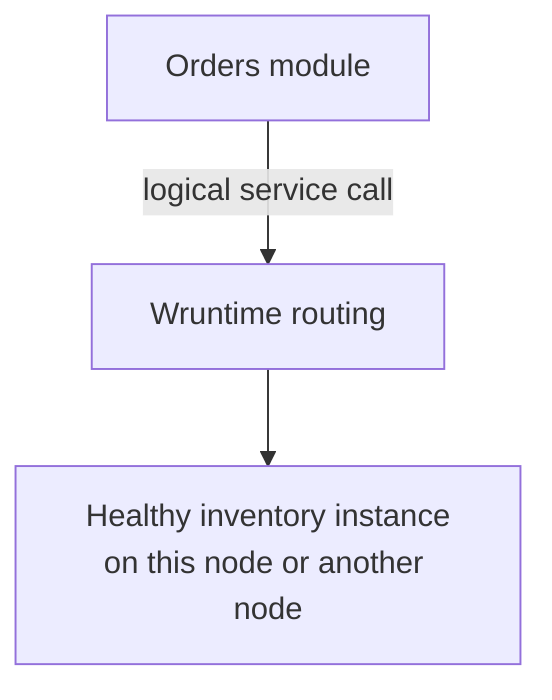
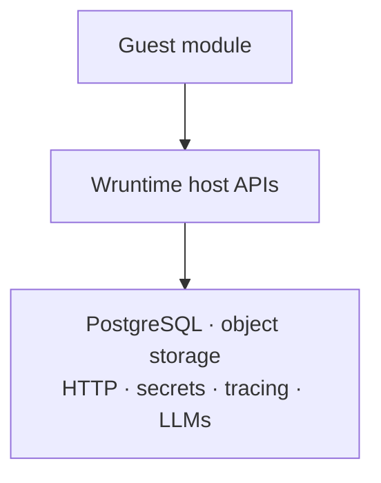

# Wruntime

Wruntime is a distributed WASI Preview 2 runtime for building applications from
small, independently deployable application modules. Each module is packaged as
a WebAssembly component, exposes protobuf services, and calls other modules
through logical URLs. Wruntime discovers healthy instances and routes each
request locally or across nodes.

Guest modules can use managed capabilities such as PostgreSQL, object storage,
tracing, secrets, external HTTP, and language models without owning the
underlying infrastructure integrations.

> [!NOTE]
> Wruntime is built with the assistance of LLM-based development tools.

## How it works

### Build application modules

Write application code with `wr-sdk`, then compile it into a WebAssembly
component targeting WASI Preview 2.


### Connect modules as services

Modules call one another through logical service URLs. Wruntime discovers a
healthy instance and routes the request within the same node or across the
network to another node.



### Use managed capabilities

Modules access infrastructure through runtime-provided APIs rather than
embedding service-specific integrations.



The full data-plane, control-plane, and cross-node request flows are described
in [Architecture](docs/architecture.md).

## Scope

Wruntime currently provides:

- logical service discovery, semantic-version routing, load balancing, circuit
  breaking, and OpenTelemetry tracing;
- multi-node peer routing over mTLS and active-active managers with PostgreSQL
  persistence and lease-based liveness;
- protobuf service modules plus durable, at-least-once workers and schedules;
- optional public ingress with request transcoding, schema validation, and deny-by-default,
  allowlisted external HTTP egress;
- guest capabilities for PostgreSQL, S3-compatible blob storage, tracing,
  Anthropic Claude, namespace-scoped secrets/environment values, and ephemeral
  scratch filesystems;
- Systemd deployment bundles, exact-revision readiness checks,
  retained-release rollback, and coherent cluster status.

See [Architecture](docs/architecture.md) for the full request and control-plane
flows.

## Quick start

A source checkout requires:

- stable Rust and Cargo;
- [`just`](https://github.com/casey/just), `protoc`, and Python 3;
- the `wasm32-wasip2` Rust target and
  [`wasm-tools`](https://github.com/bytecodealliance/wasm-tools);
- Docker with Compose for PostgreSQL, RustFS, and local observability services;
- OpenSSL for local example secrets.

```bash
rustup target add wasm32-wasip2

just dev-up
just certs
just multi-node-inline
```

A successful run sends an Echo request through Node A, across an mTLS peer
connection, to a WASM module on Node B. Stop the shared development services
with `just dev-down`. See the [multi-node example](examples/multi-node/) for the
interactive topology and port map.

## Build a guest module

Start with the [Guest Module Author guide](docs/agents/guest-module-author/README.md):

- [module template](docs/agents/guest-module-author/module_template.md) — current
  manifest, WIT world, build script, and validation shape;
- [API guide](docs/agents/guest-module-author/api_guide.md) — preferred SDK usage
  and lifecycle semantics;
- [worked examples](docs/agents/guest-module-author/examples.md) — production
  patterns and their supporting configuration.

Exact guest contracts live in [`wr-sdk/src/`](wr-sdk/src/),
[`wr-build/src/lib.rs`](wr-build/src/lib.rs), and root [`wit/`](wit/). Prefer the
SDK facades and generated protobuf clients over raw WIT bindings unless an
operation is not otherwise exposed.

## Executable examples

| Example | Demonstrates |
| --- | --- |
| [Ecommerce](examples/ecommerce/) | Generated client/service calls, PostgreSQL migrations, load balancing, tracing |
| [Stockmarket](examples/stockmarket/) | Multiple services, persistence, and configurable replicas |
| [Codegen](examples/codegen/) | Workers, LLM, database, blobstore, egress, and scratch filesystem |
| [Multi-node](examples/multi-node/) | Cross-node placement and mTLS peer routing |

Use `just` with no arguments to list every build, test, example, and deployment
validation recipe. Common maintainer commands are:

```bash
just build
just tidy
just test
just test-wasm
just validate-ecommerce
```

Testing prerequisites and the change-sensitive validation matrix are linked
from [Testing](docs/testing.md). To inspect the repository-local CLI, run
`just cli --help`.

## Repository map

| Path | Purpose |
| --- | --- |
| `wr-manager/` | Active-active registry, routing state, schedules, secrets, and cluster status |
| `wr-proxy/` | Local/peer routing, public ingress, egress policy, and circuit breaking |
| `wr-engine/` | Wasmtime component execution, host capabilities, workers, and module lifecycle |
| `wr-sdk/`, `wr-sdk-macros/`, `wr-build/` | Guest SDK, macros, and protobuf service/client generators |
| `wr-cli/` | Development, operations, certificate, and deployment CLI |
| `wr-common/`, `proto/`, `wit/` | Shared Rust types, control-plane protobuf, and guest host ABI |
| `wr-tests/` | Integration and WASM host-binding tests |
| `examples/` | Executable guest applications and local topologies |
| `docs/` | Public guides, references, and contributor workflows |

## Documentation

- [Architecture](docs/architecture.md) — topology, trust boundaries, request flow,
  clustering, workers, and schedules
- [Configuration](docs/configuration.md) — manager, proxy, engine, module, ingress,
  egress, and capability configuration
- [Module SDK](docs/sdk.md) — `wr-sdk` and `wr-build` overview
- [Host bindings](docs/host-bindings.md) — database, blobstore, tracing, LLM,
  environment, and filesystem behavior
- [Schemas](docs/schemas.md) — protobuf descriptors, validation, and RPC paths
- [Control-plane and job APIs](docs/grpc-api.md) — manager/node gRPC and worker HTTP
  RPC contracts
- [Deployment](docs/deployment.md) — bundles, Systemd lifecycle, mTLS,
  rollback, and cluster status
- [Testing](docs/testing.md) — local infrastructure, focused tests, and full
  validation
- [Contributor modes](docs/agents/README.md) — guest-module and runtime-maintainer
  workflows
