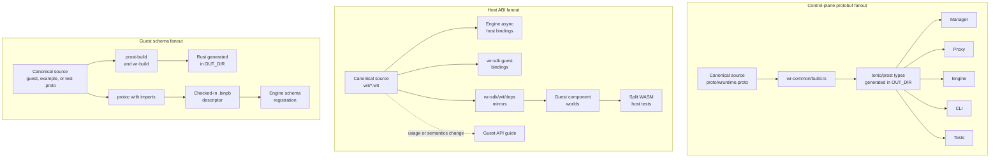

# Generated Contracts

Treat generators and generated artifacts as a fanout, not as isolated files.

## Rules

- Never edit generated Rust under Cargo `OUT_DIR`; change the proto, WIT, or generator.
- Root [`wit/`](../../../wit/) is canonical. Synchronize matching files under [`wr-sdk/wit/deps/`](../../../wr-sdk/wit/deps/) in the same change.
- Regenerate every affected checked-in `.binpb` descriptor with imports included.
- Keep guest `world.wit` imports aligned with enabled module capabilities.
- `wr-build` emits service `_router` and `_handle` helpers; worker clients are generated only for services whose names end in `WorkerService`.
- SDK, WIT, build-generator, or host-binding changes require focused `just test-wasm-one <target>` where possible and full `just test-wasm` before completion.
- Update the guest API guide when preferred usage or guest-visible semantics change. Exact signatures stay in Rust/WIT source.
- Manager migrations under `wr-manager/migrations/` modify control-plane state. Module migrations are trusted guest-owned SQL, run at engine startup with target-database admin credentials and the module schema as the default `search_path`, and use a separate history/cancellation-safe locking policy.

## Review checklist

1. Identify the canonical source.
2. Find every generated or mirrored consumer.
3. Regenerate rather than hand-edit outputs.
4. Update source-owned tests and downstream fixtures.
5. Run the focused validation in [validation.md](validation.md).
6. Update the documentation owner in [documentation_ownership.md](documentation_ownership.md).
