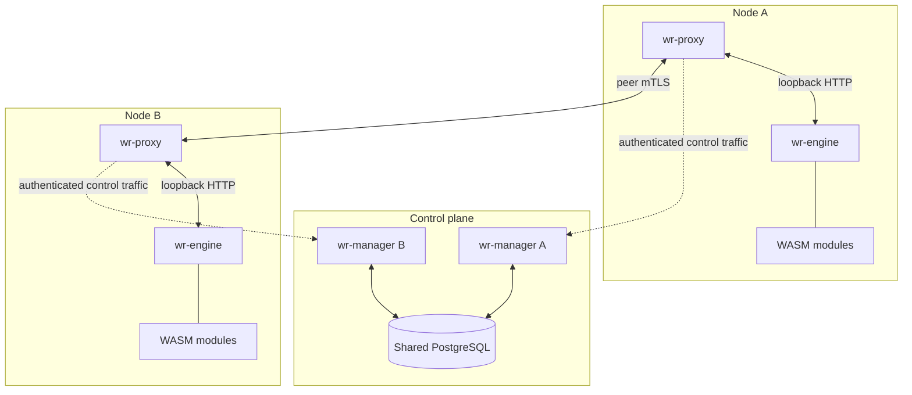
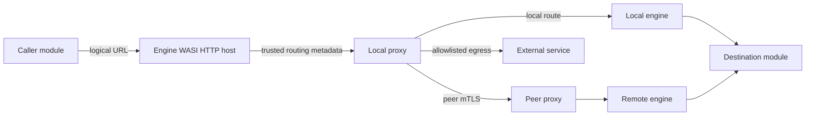

# Architecture

Wruntime runs WASI Preview 2 components as independently deployable modules. A
node contains one proxy and one or more engines. Managers form an active-active
control plane backed by shared PostgreSQL.

## Components

| Binary | Default listeners | Responsibility |
| --- | --- | --- |
| `wr-manager` | `9000` mTLS gRPC | Registry, routing, policy, infrastructure, lifecycle, jobs, schemas, schedules, secrets, and PostgreSQL-backed manager membership. |
| `wr-proxy` | `9001` loopback HTTP, `9002` loopback control, `9443` peer mTLS | Routes streaming requests to local engines, peer proxies, or allowed external hosts. Optional public ingress validates and transcodes request bodies. |
| `wr-engine` | `9100` loopback HTTP and a configured manager-only job-admin mTLS listener | Loads components, enforces host capabilities, runs workers, and reports module health. |
| `wr-cli node agent` | No listener | Pulls manager-authorized lifecycle work and applies typed Systemd effects for one node. |

A module is identified by `(namespace, name, version)`. Calls use logical URLs
such as `http://ecommerce.inventory/inventory.InventoryService/GetItem`; callers
do not select an engine address.

## Trust boundaries

Manager gRPC and peer-proxy traffic use mTLS. Manager authorization requires a
valid client certificate, one project URI SAN, a policy role and scope, and a
non-revoked leaf SHA-256 fingerprint. The manager uses a distinct client
certificate when calling an engine's job-admin listener.

Engine and proxy data/control listeners are plain HTTP only on the documented
loopback boundary. Public ingress removes all caller-supplied `x-wr-*` headers
before adding trusted routing metadata. Source and routing headers support
routing and observability; they never grant authorization.

Development preserves the database authority boundary with one isolated Compose
stack per linked worktree. Consumers verify the published generation's internal
manifest, artifact, endpoint, and PKI bindings without requiring current
source-hash equality. A later host `just dev-up` converges provisioning and
immutable migrations against retained volumes and never destroys database state
automatically.

Guest capabilities are opt-in. Before loading a component, the engine compares
its WIT imports with the module's configured database, blobstore, and LLM
capabilities. Host implementations still enforce scope, input limits, and
resource limits on every call.

## Tenant database lifecycle

Tenant data uses one retained PostgreSQL database per namespace. This is an
authorization boundary; a module's `search_path` is only default name
resolution. Modules in one namespace are mutually trusted, while runtime roles
cannot access other namespace databases, platform databases, owner/DDL powers,
`wr__jobs`, or `wr_system`.

Tenant administration is offline and database-host-local:

1. `wr-cli node reserve-deployment` creates the manager-bound revision identity
   without changing a worker node.
2. `wr-cli postgres provision` converges namespace databases, roles, schemas,
   and PostgreSQL certificate mappings.
3. `wr-cli postgres migrate` executes immutable module migrations with bounded,
   disposable owner-capable logins and records their hashes in a platform
   ledger.
4. Deployment installs a dedicated `postgres-client` node certificate and
   generated `[database.tenant]` state outside the release.
5. Registration returns resolved application secrets and deterministic,
   non-secret namespace access descriptors. The manager neither creates tenant
   credentials nor provisions PostgreSQL.
6. Engine startup compares those descriptors with node-local expected state,
   uses a one-shot readiness login to verify provisioning and migration
   receipts, disconnects, and then creates certificate-authenticated runtime
   pools.

`database.url` is separate platform configuration for the engine's `wr__jobs`
queue database. The engine applies its embedded job-queue migrations at startup
before opening job administration or starting workers. Manager migrations and
tenant module migrations follow separate policies.

See [Deployment](deployment.md#database-enabled-nodes) for the operator workflow
and [Configuration](configuration.md#database-pool-and-timeout-settings) for the
current keys.

## Lifecycle and readiness

Each process exposes the monotonic stages `STARTING → READY → STOPPING` through
the read-only `LifecycleService`. Lifecycle describes one process, not cluster
health. `GetClusterStatus` separately reports manager membership, deployment,
routing, proxy, engine, and module health.

Readiness barriers differ by service:

- A manager validates its TLS identities and authorization policy, connects and
  migrates its database, registers its lease, starts required background tasks,
  and binds the unified mTLS endpoint.
- A proxy reaches a manager, installs an initial routing snapshot, and binds its
  loopback, peer, and optional public listeners.
- An engine binds with admission closed, registers initially unhealthy routes,
  verifies offline tenant state, migrates `wr__jobs`, constructs pools and host
  capabilities, loads and health-checks modules, and publishes a readiness
  heartbeat. It opens admission only after its local proxy installs the returned
  routing version.

Process owners request shutdown with SIGTERM or SIGINT. Engines stop admitting
new work, withdraw routes, wait for proxy convergence, drain accepted work, and
deregister. Proxies close data listeners before background tasks. A service's
signal-driven shutdown shares one 30-second internal deadline; generated
Systemd units provide a 45-second external stop window.

Local development uses one foreground `wr-cli dev run` owner. It starts manager,
proxy, and engine waves in order, verifies the expected service kind and
activation identity, waits for proxy routing convergence, runs the optional
scenario, and reaps all children on exit.

## Deployed lifecycle and recovery

Remote intent follows `operator → manager → node agent → Systemd → process`.
The manager stores durable operations and per-slot authority. A node-bound agent
pulls typed work; it never receives shell commands. Agent activation and lease
epoch fence stale work, and backend inspection—not endpoint disappearance—proves
whether a process exited.

A deployment describes the complete desired engine inventory. The manager
reconciles additions, replacements, and removals while enforcing
`max_unavailable`; removing final capacity requires explicit downtime consent.
Cancellation before commit restores the source inventory. Rollback is a new,
explicitly authorized revision rather than an automatic response to failure.
Ambiguous host evidence pauses the operation so an operator can inspect and
resume it without guessing.

The node agent has no durable recovery journal. Durable intent and receipts live
at the manager; a replacement agent receives fresh inspection work. Release
cleanup is independent maintenance and cannot change a committed serving result.
Operator commands and recovery decisions are documented in
[Deployment](deployment.md#operations-and-recovery).

## Manager clustering and status

Managers share one PostgreSQL database. Each manager renews a lease using
server-side database time; only lease-fresh rows appear in discovery. Proxies
normally discover managers through `ListManagers` and retain direct PostgreSQL
access only as a bootstrap fallback.

`GetClusterStatus` returns one manager-composed snapshot. Proxies push
authenticated inventory reports to managers; status does not scrape proxies or
hosts. Severity is derived from current deployment, registration, heartbeat,
route, and proxy evidence. Callers should branch on typed condition code and
severity rather than parsing explanatory text.

## Request flow

Public ingress additionally maps configured aliases to canonical protobuf RPC
paths, validates bounded protobuf/JSON/form input against the selected module's
descriptor, and forwards normalized protobuf bytes. Internal module and peer
traffic stays streaming and is not transcoded again. Responses stream without
representation conversion.

Routing distinguishes exact semantic versions, ranges, and unpinned requests.
Only healthy routes are eligible. Circuit breakers are scoped to concrete local
engine or peer-proxy destinations and survive routing refreshes while that
destination remains active.

## Workers and schedules

Workers consume an engine-managed PostgreSQL queue. Claims record a fence and a
fixed lease expiry; recovery can redeliver expired work without allowing the
stale claimant to update queue state. Delivery is at least once, so handlers
must make side effects idempotent.

A non-empty ad-hoc worker version is exact; an empty version is name-only.
Manager schedules are always version-pinned and submit through the manager's
configured local proxy. Job administration enters through the manager's normal
mTLS endpoint and is scoped by authorization policy to explicit queue IDs.

Exact service and message fields remain in [`proto/wruntime.proto`](../proto/wruntime.proto).
See [gRPC API](grpc-api.md) for non-obvious control-plane semantics and
[Host bindings](host-bindings.md) for guest capabilities.
