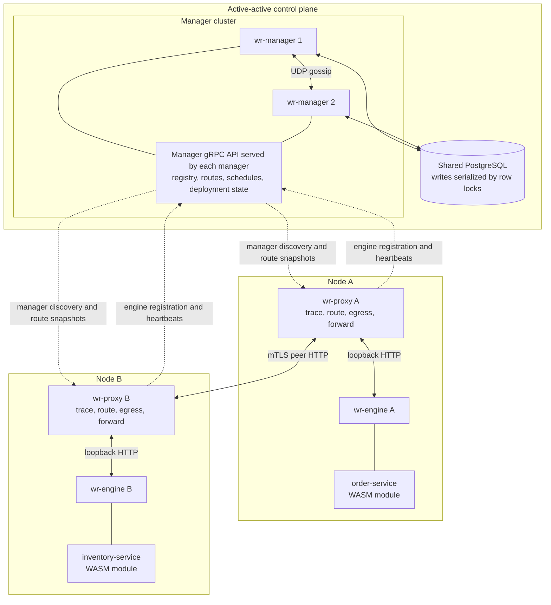
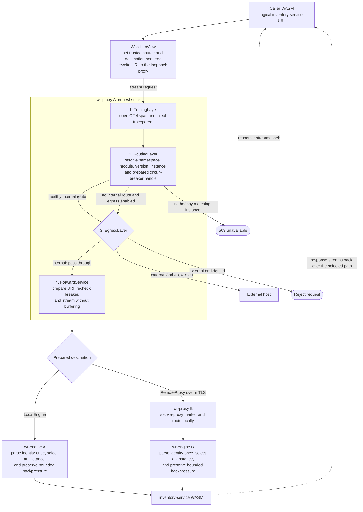
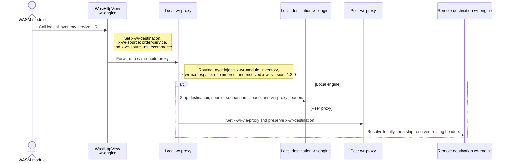

# Architecture

A **node** is one `wr-proxy` co-located with one or more `wr-engine` instances. Nodes are independent — each proxy handles its own inbound traffic and forwards cross-node requests directly to the peer proxy, which then routes locally to its engines.

## Components

| Binary | Default port | Role |
| -------- | ------------- | ------ |
| `wr-manager` | `9000` (gRPC) + `9010` (gossip) | Registry — engines register here, proxies sync routing tables from here. Runs active-active behind shared Postgres; chitchat gossip provides manager-to-manager liveness detection. On registration the manager resolves the engine's requested secrets and per-namespace DB credentials, then persists the engine, its schemas, and one initially-unhealthy default routing rule per schema-bearing module in a single transaction — a failed registration leaves no routing rules. |
| `wr-proxy` | `9001` (HTTP) + `9002` (gRPC control plane) | Streaming header-based router — intercepts and routes inter-module traffic; forwards cross-node requests to peer proxies; request and response bodies flow through without buffering. The control plane (`NodeService`) handles engine registration and heartbeats |
| `wr-engine` | `9100` (HTTP) | Loads WASM modules, runs them, and receives forwarded requests |

A **node** groups one `wr-proxy` with one or more `wr-engine` instances. `[node].proxy_address` and `[node].control_address` are explicit loopback URLs; `[node].peer_address` is the separately advertised mTLS URL used across nodes. Engines keep ephemeral process IDs but deployed configs also report a stable operator-supplied node ID, manager-assigned monotonic revision, immutable bundle digest, and stable engine slot. The manager persists desired revision history and verifies those identities against fresh heartbeats and healthy default routes.

At component load, the engine inspects top-level WIT imports and rejects modules that import the DB, blobstore, or LLM host interfaces without enabling the corresponding module capability. Enabled capabilities are constructed as scoped bundles: DB access always carries its namespace pool, required module schema, timeouts, and telemetry policy; blobstore access always carries its runtime, namespace prefix, and limits. Host-side missing-capability and input validation remain defense in depth for raw generated bindings.

Database authorization is per namespace. The manager generates and stores a namespace credential during registration; the engine uses one eager administrative pool, capped by `[database].max_connections`, to converge roles, admin-owned module schemas, and grants before readiness. Each DB-enabled namespace has one clean-recycled guest pool sized by the checked sum of every configured instance's effective `db_max_connections` contribution. Each configured worker has one additional non-pooled PostgreSQL `LISTEN` session. Guest pools authenticate as the namespace role. A module-specific `search_path` selects the default schema for unqualified SQL, but the role can use fully qualified names for every module schema granted to its namespace. Namespace roles can create objects in granted schemas but do not own or drop the schemas. Other namespace roles and every guest role remain denied access to unrelated schemas, `wr__jobs`, and `wr_system`.

The engine normalizes database startup work by `(namespace, module)`: duplicate configured instances or versions still load independently and all contribute pool capacity, but their shared schema is provisioned and migrated once. Engine-owned `wr__jobs` migrations are embedded, serialized separately from module migrations, and complete before worker loops or readiness. Claims atomically persist a fence and fixed lease expiry derived from the submitted job timeout. One recovery coordinator per engine reclaims expired leases; multiple engines remain safe through row locking and fenced updates.

## Service lifecycle and readiness

Every service exposes the monotonic process stages `STARTING → READY → STOPPING` through the read-only `LifecycleService`. Lifecycle is a process-stage contract, not cluster availability: a manager can be `READY` while gossip evidence is degraded, and route/module health remains in `GetClusterStatus`. Process owners initiate graceful shutdown with SIGTERM or SIGINT; route withdrawal and draining remain internal stop phases rather than lifecycle RPC states.

Readiness barriers are service-specific:

- A manager becomes ready after configuration/TLS validation, database bootstrap and migrations, manager registration, gossip bind and metadata publication, scheduler/route-monitor ownership, and successful mTLS gRPC bind.
- A proxy becomes ready after manager discovery succeeds, an initial routing snapshot is installed, and its loopback control, internal, peer mTLS, and optional external listeners are all bound.
- An engine binds its loopback control/workload listener with workload admission closed, then registers, provisions schemas, runs job and module migrations, builds pools, starts owned recovery/worker/module work, loads and health-checks every configured module, and publishes one synchronous readiness heartbeat. The manager atomically records that publication and returns a routing version; the proxy does not acknowledge it until its local routing snapshot contains at least that version. Only then does the engine open workload and worker admission and enter `READY`.

Lifecycle observation remains on existing trusted listeners: a manager serves it on its mTLS gRPC listener, a proxy on its loopback NodeService listener, and an engine on its loopback HTTP/2 listener. Engine startup rejects a non-loopback bind, and routed requests cannot invoke lifecycle methods. All listeners, refresh/heartbeat loops, worker/LISTEN/recovery tasks, module request tasks, and accepted connections are owned and joined; unexpected required-task exit fails the process.

Shutdown closes admission before teardown. An engine first stops new worker claims and healthy-heartbeat publication, asks the manager to make its routes non-serving, waits for the local proxy to install the returned withdrawal version, closes HTTP admission, drains accepted requests and claimed jobs, and only then deregisters. A proxy closes all data listeners before joining its control and background tasks. A manager rejects new mutations while retaining required engine drain/deregister operations during teardown. Each signal-driven stop uses one absolute 30-second internal deadline; nested waits never reset it. Deadline expiry aborts and joins named leftovers and produces a non-zero exit.

Local foreground orchestration is owned by one scoped `wr-cli dev run` process; guest artifacts are built separately before the foreground run. It starts fixed waves—manager, named proxies concurrently, then engines concurrently—and validates launcher-issued activation identity plus exact service kind at every READY endpoint. After all engines are READY it captures the manager routing-table version and requires every exact proxy activation to report at least that installed version before launching the optional scenario. The scenario runs in its own session so interruption or service failure terminates its entire process group. Cleanup reaps concurrent engine, proxy, then manager waves; the 45-second termination-policy boundary latches failure evidence but the sole child owner stays alive in reap-only mode until exit is proven. Scenario failure remains primary, while cleanup failure is reported independently and makes a clean scenario fail. The command creates no supervisor socket, lock, or persistent process state. For deployed engines, `wr-cli node stop` delegates stop and final-exit proof to the generated systemd unit or Docker Compose service under one 45-second budget; lifecycle observation is not exit proof.

## Manager clustering (active-active)

Multiple `wr-manager` instances can run simultaneously for high availability. All managers share the same Postgres database — concurrent writes are serialized via `SELECT ... FOR UPDATE NOWAIT` on a lock sentinel row. Each manager:

1. Registers itself in the `wr_managers` table on startup (UUID, gRPC address, gossip address).
2. Heartbeats every 15 seconds; cleans up stale managers (60 s timeout).
3. Participates in a [chitchat](https://docs.rs/chitchat) gossip mesh (UDP), publishing its own `grpc_address`/`gossip_address` into gossip node state. Chitchat's phi-accrual failure detector is the **primary** manager liveness mechanism — `gossip_listen_address` is required and must be reachable, or the manager fails to start.
4. Deregisters itself on graceful shutdown.

`ListManagers` returns a per-manager reconciliation of the DB-heartbeat-fresh set against chitchat — peers chitchat has marked dead are dropped immediately; peers gossip has never seen are included only during a short bootstrap convergence window after a manager starts, then excluded. Proxies discover managers via `ListManagers` (chitchat-reconciled), bootstrapping and falling back to a direct `wr_managers` query only when no manager RPC is reachable. The Postgres 60s heartbeat cleanup (`cleanup_stale_managers`) remains as a secondary safety-net backstop.

`GetClusterStatus` is the authoritative composed operator view. A contacted manager captures all PostgreSQL evidence—current and historical desired revisions, registrations, engine/module heartbeat times, persisted routes, manager records, and routing version—in one repeatable-read transaction, then composes a separately timestamped gossip observation. It reuses deployment verification rather than inferring intent from routes or ephemeral engine IDs. Aggregate severity is derived, never persisted. Previous revisions and unmanaged engines remain visible evidence but cannot satisfy desired readiness. Unsupported direct proxy/host signals remain explicitly unknown/not reported.

## Scheduler (routed job control plane)

Each manager runs a background scheduler that fires `wr_schedules` rows as jobs, using Postgres as a claim/lease queue with a fencing token (`claim_id`) so active-active managers cannot double-fire or clobber each other's in-flight attempts. Every tick runs three short phases:

1. **Claim** — a short transaction claims due, unleased (or lease-expired) rows with `FOR UPDATE SKIP LOCKED`, stamping `claimed_by`, `claimed_until` (a lease), and a fresh `claim_id`, then commits immediately.
2. **Submit** — outside any transaction, the manager submits each claimed job through its own configured `local_proxy_address` (the local proxy loopback), exactly like `wr-cli invoke`: POST `/wruntime.WorkerService/SubmitJob` with `x-wr-destination: http://{namespace}.{module}/wruntime.WorkerService/SubmitJob`, using the same routing/mTLS path as normal inter-module traffic.
3. **Finalize** — a fenced `UPDATE ... WHERE claim_id = $claim_id` records success (advances `next_fire_at`, clears the lease) or failure (records `last_error`, bumps `consecutive_failures`, backs off `next_fire_at`); a finalize whose `claim_id` no longer matches (row reclaimed by another manager) affects zero rows and is dropped.

Delivery is **at-least-once** — a manager crash between submit and finalize leaves the lease to expire (`claimed_until < NOW()`), and the row becomes claimable again — so scheduled jobs must be idempotent. The manager's `/wruntime.WorkerService/SubmitJob` submission path is the one place the scheduler couples to the worker/job subsystem's endpoint contract; if that endpoint changes, only `wr_manager::scheduler::submit_job` needs to change. Scheduled jobs are version-pinned. Ad-hoc submissions may omit `worker_version`; these legacy name-only jobs are claimed by the first matching namespace/name worker version, while non-empty versions remain exact.

## Request flow

Public ingress is the guest-module data-plane trust boundary. `IngressLayer` strips reserved headers, authorizes a configured public path and method, and rewrites any REST-style alias to the route's required canonical `rpc_path`. After routing selects an exact healthy module version, `SchemaValidationLayer` lazily loads that version's descriptor set from the manager, buffers the external request body once, and decodes it as the RPC input message before forwarding. Invalid protobuf is rejected at the boundary. The loopback internal stack and mTLS peer stack deliberately omit this layer, so wruntime-generated module, worker, scheduler, and cross-node continuation traffic remains trusted and streams without repeated validation.

The engine does not collect network request or guest response bodies at dispatch. A response-body owner retains the guest task, `Store<ModuleState>`, and owned instance permit through body completion. Normal end joins the task; a body error, timeout, or client drop cancels it so those resources cannot remain detached. Health checks drain their responses. Worker requests enter through the same body type from their already-buffered protobuf payload, and worker responses are deliberately collected only at the job-result persistence boundary.

## Request headers (`x-wr-*`)

All internal routing uses a set of reserved `x-wr-*` HTTP headers. The proxy strips every `x-wr-*` header from externally-originated requests (public routes) to prevent spoofing.

| Header | Set by | Read by | Description |
| -------- | -------- | --------- | ------------- |
| `x-wr-destination` | `wr-engine` (outbound WASM call), `wr-proxy` IngressLayer (public routes) | `wr-proxy` RoutingLayer, TracingLayer | Full destination URI — e.g. `http://ecommerce.inventory/inventory.InventoryService/GetItems`. The host encodes internal destinations as `{namespace}.{module}`; public ingress replaces any external alias with the route's canonical `rpc_path`. Stripped by ForwardService before reaching the destination engine. |
| `x-wr-source` | `wr-engine` (outbound WASM call), `wr-proxy` IngressLayer (set to `"external"` for public routes) | `wr-proxy` TracingLayer | Name of the calling module. Recorded as a span attribute for metrics attribution and error reporting. Stripped by ForwardService before reaching the destination engine. |
| `x-wr-source-ns` | `wr-engine` (outbound WASM call) | — | Namespace of the calling module. Carried alongside `x-wr-source` as attribution metadata; not used for routing or authorization decisions. Stripped by ForwardService before reaching the destination engine. |
| `x-wr-version` | Caller (optional — WASM module or `wr-cli`) | `wr-proxy` RoutingLayer | Pins the request to a specific semver of the destination module (e.g. `1.2.0`). When omitted the proxy load-balances across all healthy versions of the module. RoutingLayer overwrites the value with the resolved version before forwarding. |
| `x-wr-module` | `wr-proxy` RoutingLayer | `wr-engine` inbound server | Resolved destination module name. The engine uses this (together with `x-wr-namespace` and `x-wr-version`) to select the correct WASM instance. |
| `x-wr-namespace` | `wr-proxy` RoutingLayer | `wr-engine` inbound server | Resolved destination module namespace. |
| `x-wr-via-proxy` | `wr-proxy` ForwardService (cross-node hop) | — | Diagnostic hop marker set to `1` when forwarding to a peer proxy. It is not consumed for routing or loop prevention and is stripped before a local engine or egress target. |

`RoutingRule.source_module` and `source_namespace` follow the same metadata-only semantics as the source headers. They are retained for future policy work but are not part of the current route index or an authorization boundary.

### Header lifecycle per request

